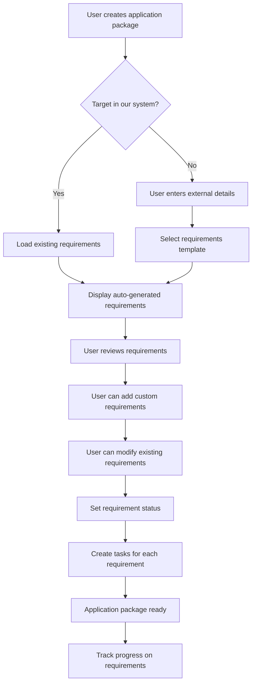
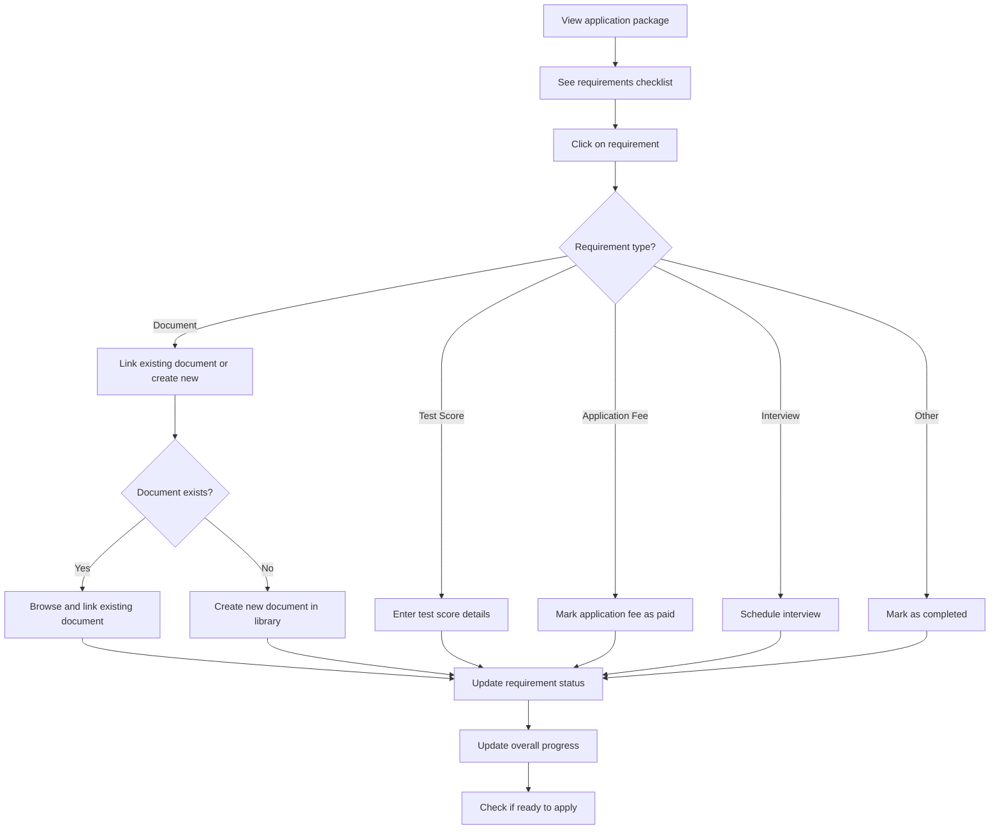
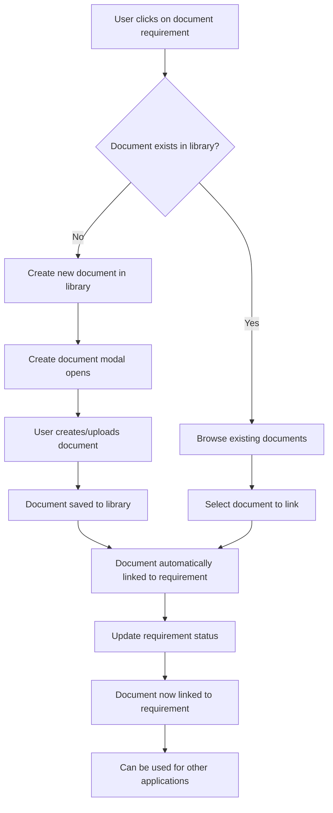

# Comprehensive Application Management System Plan

## 📋 Executive Summary

This plan outlines the implementation of a robust application management system for Eddura.com that helps students manage their entire application journey from discovery to decision. The system will support both internal (platform-listed) and external schools/programs/scholarships, with comprehensive requirements tracking and document management.

## 🎯 Core Philosophy & Architecture

### Current State Analysis
**✅ Already Implemented:**
- Scholarship application forms with templates
- Document creation and management system
- Basic application tracking (draft, in_progress, submitted, etc.)
- Task management system
- User authentication and profiles
- Saved scholarships functionality
- Program and School models with basic requirements

**🔄 Needs Enhancement:**
- **Requirements Management System** - Structured tracking of required documents and criteria
- Application package management (linking documents to applications)
- Interview management
- Deadline tracking with notifications
- Status tracking with visual indicators
- Support for external schools/programs not in the system
- Linking scholarships to school applications
- Comprehensive application dashboard

## 🗄️ Database Schema Design

### 1. Application Requirements Model (NEW)
```typescript
interface IApplicationRequirement extends Document {
  applicationId: mongoose.Types.ObjectId;
  requirementType: 'document' | 'test_score' | 'fee' | 'interview' | 'other';
  category: 'academic' | 'financial' | 'personal' | 'professional' | 'administrative';
  
  // Requirement details
  name: string; // e.g., "Personal Statement", "TOEFL Score", "Application Fee"
  description?: string;
  isRequired: boolean;
  isOptional: boolean;
  
  // Document-specific requirements
  documentType?: 'personal_statement' | 'cv' | 'transcript' | 'recommendation_letter' | 'test_scores' | 'portfolio' | 'financial_documents' | 'other';
  maxFileSize?: number; // in MB
  allowedFileTypes?: string[];
  wordLimit?: number;
  characterLimit?: number;
  
  // Test score requirements
  testType?: 'toefl' | 'ielts' | 'gre' | 'gmat' | 'sat' | 'act' | 'other';
  minScore?: number;
  maxScore?: number;
  scoreFormat?: string; // e.g., "120 total, 25+ per section"
  
  // Application fee requirements
  applicationFeeAmount?: number;
  applicationFeeCurrency?: string;
  applicationFeeDescription?: string;
  applicationFeePaid?: boolean;
  applicationFeePaidAt?: Date;
  
  // Interview requirements
  interviewType?: 'in-person' | 'virtual' | 'phone' | 'multiple';
  interviewDuration?: number; // in minutes
  interviewNotes?: string;
  
  // Status tracking
  status: 'pending' | 'in_progress' | 'completed' | 'waived' | 'not_applicable';
  submittedAt?: Date;
  verifiedAt?: Date;
  notes?: string;
  
  // Document linking (links to existing documents in user's library)
  linkedDocumentId?: mongoose.Types.ObjectId; // Reference to existing Document model
  externalUrl?: string; // If stored elsewhere (not in our system)
  taskId?: mongoose.Types.ObjectId; // Associated task
  
  // Metadata
  order: number; // Display order
  createdAt: Date;
  updatedAt: Date;
}
```

### 2. Enhanced Application Model
```typescript
interface IApplication extends Document {
  userId: mongoose.Types.ObjectId;
  applicationType: 'scholarship' | 'school' | 'program' | 'external';
  
  // Target identification (flexible for internal/external)
  scholarshipId?: mongoose.Types.ObjectId;
  schoolId?: mongoose.Types.ObjectId;
  programId?: mongoose.Types.ObjectId;
  
  // External application support
  externalSchoolName?: string;
  externalProgramName?: string;
  externalApplicationUrl?: string;
  
  // Application package details
  name: string; // e.g., "MIT Computer Science Application"
  status: ApplicationStatus;
  priority: 'low' | 'medium' | 'high' | 'urgent';
  
  // Requirements management
  requirements: mongoose.Types.ObjectId[]; // References to ApplicationRequirement
  requirementsProgress: {
    total: number;
    completed: number;
    required: number;
    requiredCompleted: number;
    optional: number;
    optionalCompleted: number;
  };
  
  // Interview management
  requiresInterview?: boolean;
  interviewScheduled?: boolean;
  interviewDate?: Date;
  interviewType?: 'in-person' | 'virtual' | 'phone';
  interviewNotes?: string;
  interviewStatus?: 'pending' | 'scheduled' | 'completed' | 'cancelled';
  
  // Timeline and deadlines
  applicationDeadline?: Date;
  decisionDate?: Date;
  appliedAt?: Date;
  decision?: 'accepted' | 'rejected' | 'waitlisted' | 'conditional';
  
  // Scholarship integration
  linkedScholarships?: {
    scholarshipId: mongoose.Types.ObjectId;
    scholarshipName: string;
    status: 'interested' | 'applied' | 'awarded' | 'rejected';
    applicationId?: mongoose.Types.ObjectId; // Separate application for scholarship
  }[];
  
  // Progress tracking
  progress: number; // 0-100%
  currentPhase: 'interest' | 'preparation' | 'application' | 'interview' | 'decision' | 'accepted' | 'rejected';
  
  // Form responses (for internal applications)
  applicationTemplateId?: mongoose.Types.ObjectId;
  sections?: ISectionResponse[];
  
  // Metadata
  notes?: string;
  tags?: string[];
  isActive: boolean;
  createdAt: Date;
  updatedAt: Date;
}
```

### 3. Requirements Template Model (NEW)
```typescript
interface IRequirementsTemplate extends Document {
  name: string; // e.g., "Graduate School Application", "Undergraduate Application"
  description?: string;
  category: 'graduate' | 'undergraduate' | 'scholarship' | 'custom';
  
  // Template requirements
  requirements: {
    requirementType: 'document' | 'test_score' | 'fee' | 'interview' | 'other';
    category: 'academic' | 'financial' | 'personal' | 'professional' | 'administrative';
    name: string;
    description?: string;
    isRequired: boolean;
    isOptional: boolean;
    
    // Document-specific
    documentType?: string;
    maxFileSize?: number;
    allowedFileTypes?: string[];
    wordLimit?: number;
    characterLimit?: number;
    
    // Test score-specific
    testType?: string;
    minScore?: number;
    maxScore?: number;
    scoreFormat?: string;
    
    // Application fee-specific
    applicationFeeAmount?: number;
    applicationFeeCurrency?: string;
    applicationFeeDescription?: string;
    
    // Interview-specific
    interviewType?: string;
    interviewDuration?: number;
    interviewNotes?: string;
    
    order: number;
  }[];
  
  // Usage tracking
  usageCount: number;
  isActive: boolean;
  createdAt: Date;
  updatedAt: Date;
}
```

### 4. Enhanced Program Model
```typescript
interface IProgram extends Document {
  // ... existing fields ...
  
  // Enhanced application requirements
  applicationRequirements: {
    documents: {
      type: 'transcript' | 'personal_statement' | 'cv' | 'recommendation_letter' | 'test_scores' | 'portfolio' | 'financial_documents' | 'other';
      name: string;
      required: boolean;
      description?: string;
      maxFileSize?: number;
      allowedFileTypes?: string[];
      wordLimit?: number;
      characterLimit?: number;
    }[];
    testScores: {
      type: 'toefl' | 'ielts' | 'gre' | 'gmat' | 'sat' | 'act' | 'other';
      name: string;
      required: boolean;
      minScore?: number;
      maxScore?: number;
      scoreFormat?: string;
    }[];
    applicationFees: {
      name: string;
      amount: number;
      currency: string;
      required: boolean;
      description?: string;
      paymentMethod?: string;
      paymentUrl?: string;
    }[];
    interviews: {
      required: boolean;
      type?: 'in-person' | 'virtual' | 'phone' | 'multiple';
      duration?: number;
      notes?: string;
    };
    additionalRequirements?: string[];
  };
}
```

### 5. Enhanced Scholarship Model
```typescript
interface IScholarship extends Document {
  // ... existing fields ...
  
  // Enhanced application requirements
  applicationRequirements: {
    documents: {
      type: 'essay' | 'cv' | 'transcript' | 'recommendation_letter' | 'financial_documents' | 'other';
      name: string;
      required: boolean;
      description?: string;
      maxFileSize?: number;
      allowedFileTypes?: string[];
      wordLimit?: number;
      characterLimit?: number;
    }[];
    testScores: {
      type: 'toefl' | 'ielts' | 'gre' | 'gmat' | 'sat' | 'act' | 'other';
      name: string;
      required: boolean;
      minScore?: number;
      maxScore?: number;
      scoreFormat?: string;
    }[];
    applicationFees: {
      name: string;
      amount: number;
      currency: string;
      required: boolean;
      description?: string;
      paymentMethod?: string;
      paymentUrl?: string;
    }[];
    interviews: {
      required: boolean;
      type?: 'in-person' | 'virtual' | 'phone';
      duration?: number;
      notes?: string;
    };
    additionalRequirements?: string[];
  };
}
```

## 🎨 User Flows

### 1. Application Package Creation with Requirements



### 2. Requirements Management Flow



### 3. Document Linking to Requirements



## 🛠️ Implementation Plan

### Phase 1: Requirements Management System (Week 1-2)

#### 1.1 Database Schema
- [ ] Create ApplicationRequirement model
- [ ] Create RequirementsTemplate model
- [ ] Update Application model with requirements tracking
- [ ] Enhance Program and Scholarship models with detailed requirements
- [ ] Add database indexes for performance

#### 1.2 API Endpoints
- [ ] `/api/application-requirements` - CRUD for requirements
- [ ] `/api/requirements-templates` - Manage requirement templates
- [ ] `/api/applications/[id]/requirements` - Requirements for specific application
- [ ] `/api/applications/[id]/requirements/[reqId]/status` - Update requirement status
- [ ] `/api/applications/[id]/requirements/[reqId]/link-document` - Link existing document to requirement
- [ ] `/api/applications/[id]/requirements/[reqId]/create-document` - Create new document for requirement

#### 1.3 Core Services
- [ ] `RequirementsService` - Manage requirements logic
- [ ] `RequirementsTemplateService` - Handle templates
- [ ] `ProgressTrackingService` - Calculate progress based on requirements
- [ ] `DocumentLinkingService` - Link existing documents to requirements
- [ ] `DocumentCreationService` - Create new documents for requirements

### Phase 2: User Interface for Requirements (Week 3-4)

#### 2.1 Requirements Management UI
- [ ] Requirements checklist component
- [ ] Requirement detail modal
- [ ] Document linking interface (browse existing + create new)
- [ ] Document creation modal integration
- [ ] Progress tracking visualization
- [ ] Add custom requirement form

#### 2.2 Application Package Builder
- [ ] Requirements template selection
- [ ] Auto-populate requirements from program/scholarship
- [ ] Custom requirement addition
- [ ] Requirement modification interface
- [ ] Requirements validation

#### 2.3 Dashboard Integration
- [ ] Requirements progress on dashboard
- [ ] Quick requirement status updates
- [ ] Missing requirements alerts
- [ ] Ready-to-apply indicators

### Phase 3: Enhanced Application Management (Week 5-6)

#### 3.1 Application Package Features
- [ ] Complete application package CRUD
- [ ] Document linking to requirements
- [ ] Interview management integration
- [ ] Scholarship linking system
- [ ] External application support

#### 3.2 Progress Tracking
- [ ] Real-time progress calculation
- [ ] Requirement completion tracking
- [ ] Overall application readiness
- [ ] Timeline management

#### 3.3 Notifications and Reminders
- [ ] Requirement deadline notifications
- [ ] Missing requirement alerts
- [ ] Progress milestone notifications
- [ ] Application readiness notifications

### Phase 4: Advanced Features (Week 7-8)

#### 4.1 Analytics and Reporting
- [ ] Requirements completion analytics
- [ ] Application success metrics
- [ ] Common missing requirements
- [ ] Time-to-completion analysis

#### 4.2 Export and Sharing
- [ ] Export requirements checklist
- [ ] Share application status
- [ ] Generate application reports
- [ ] Requirements comparison

#### 4.3 Integration and Polish
- [ ] Task management integration
- [ ] Calendar integration
- [ ] Document library integration
- [ ] User experience optimization

## 📁 File Structure

```
app/
├── (user-portal)/
│   ├── applications/
│   │   ├── packages/
│   │   │   ├── page.tsx                    # Application packages dashboard
│   │   │   ├── create/
│   │   │   │   └── page.tsx                # Create new package with requirements
│   │   │   └── [id]/
│   │   │       ├── page.tsx                # Package detail with requirements
│   │   │       ├── edit/
│   │   │       │   └── page.tsx            # Edit package and requirements
│   │   │       ├── requirements/
│   │   │       │   ├── page.tsx            # Requirements management
│   │   │       │   └── [reqId]/
│   │   │       │       └── page.tsx        # Individual requirement detail
│   │   │       └── documents/
│   │   │           └── page.tsx            # Document linking
│   │   └── templates/
│   │       └── page.tsx                    # Requirements templates

api/
├── application-requirements/
│   ├── route.ts                            # CRUD for requirements
│   └── [id]/
│       ├── route.ts                        # Individual requirement operations
│       ├── status/
│       │   └── route.ts                    # Update requirement status
│       └── link-document/
│           └── route.ts                    # Link document to requirement
├── requirements-templates/
│   ├── route.ts                            # Template management
│   └── [id]/
│       └── route.ts                        # Individual template operations
└── applications/
    └── [id]/
        ├── requirements/
        │   └── route.ts                    # Requirements for application
        └── progress/
            └── route.ts                    # Progress calculation

components/
├── applications/
│   ├── RequirementsChecklist.tsx           # Requirements checklist component
│   ├── RequirementCard.tsx                 # Individual requirement display
│   ├── RequirementDetailModal.tsx          # Requirement detail modal
│   ├── DocumentLinkingModal.tsx            # Browse and link existing documents
│   ├── DocumentCreationModal.tsx           # Create new documents for requirements
│   ├── AddRequirementModal.tsx             # Add custom requirements
│   ├── RequirementsTemplateSelector.tsx    # Template selection
│   ├── ProgressTracker.tsx                 # Progress visualization
│   └── ApplicationPackageBuilder.tsx       # Package creation wizard
├── shared/
│   ├── RequirementStatusBadge.tsx          # Status indicators
│   ├── ProgressBar.tsx                     # Progress bars
│   └── RequirementsSummary.tsx             # Requirements summary

models/
├── ApplicationRequirement.ts               # Requirements model
├── RequirementsTemplate.ts                 # Templates model
├── Application.ts                          # Enhanced application model
├── Program.ts                              # Enhanced program model
└── Scholarship.ts                          # Enhanced scholarship model

services/
├── RequirementsService.ts                  # Requirements business logic
├── RequirementsTemplateService.ts          # Template management
├── ProgressTrackingService.ts              # Progress calculation
└── DocumentLinkingService.ts               # Document linking logic

types/
├── requirements.ts                         # Requirement types
├── templates.ts                            # Template types
└── applications.ts                         # Application types
```

## 🎯 Key Features Implementation

### 1. Requirements Management System
- **Structured Requirements**: Predefined categories (academic, financial, personal, professional, administrative)
- **Flexible Requirements**: Support for documents, test scores, fees, interviews, and custom requirements
- **Auto-Population**: Automatically populate requirements from program/scholarship data
- **Custom Requirements**: Allow users to add requirements not covered by templates
- **Status Tracking**: Track completion status for each requirement
- **Document Linking**: Link existing documents to specific requirements

### 2. Document Management Integration
- **Existing Document System**: Leverage your current document creation/upload system
- **Document Reusability**: Documents created once in the library can be linked to multiple applications
- **Smart Document Linking**: Browse existing documents and link them to requirements
- **Seamless Document Creation**: If a required document doesn't exist, create it directly from the requirement
- **Document Validation**: Validate documents against requirements (file size, type, word limits)
- **Document Sharing**: Use existing document sharing system for review and feedback

### 3. Requirements Templates
- **Pre-built Templates**: Templates for common application types (graduate, undergraduate, scholarship)
- **Customizable Templates**: Users can modify templates for their needs
- **Template Library**: Reusable templates for different application types
- **Template Sharing**: Share custom templates with other users

### 4. Progress Tracking
- **Real-time Progress**: Calculate progress based on completed requirements
- **Visual Indicators**: Clear progress bars and status indicators
- **Requirement Categories**: Track progress by requirement category
- **Ready-to-Apply Status**: Determine when application is ready to submit

### 5. External Application Support
- **Custom Requirements**: Add requirements for external schools/programs
- **Requirement Templates**: Use templates as starting point for external applications
- **Flexible Tracking**: Track any type of requirement for external applications
- **Import/Export**: Import requirements from external sources

## 🔧 Technical Considerations

### Performance Optimization
- **Efficient Queries**: Optimize database queries for requirements and progress
- **Caching**: Cache frequently accessed requirement data
- **Batch Operations**: Support batch updates for multiple requirements
- **Lazy Loading**: Load requirement details on demand

### Data Validation
- **Requirement Validation**: Validate requirement data and relationships
- **Document Validation**: Validate documents against requirements
- **Progress Validation**: Ensure progress calculations are accurate
- **Status Validation**: Validate requirement status transitions

### User Experience
- **Intuitive Interface**: Clear and easy-to-use requirements management
- **Visual Feedback**: Clear visual indicators for requirement status
- **Quick Actions**: Easy access to common requirement actions
- **Mobile Responsive**: Ensure interface works on all devices

## 📊 Success Metrics

### User Engagement
- **Requirements Completion Rate**: Track how many requirements are completed
- **Application Readiness**: Measure time from requirements setup to application readiness
- **Template Usage**: Monitor usage of requirement templates
- **Custom Requirements**: Track addition of custom requirements

### System Performance
- **Requirement Load Times**: Monitor performance of requirements loading
- **Progress Calculation**: Track accuracy and speed of progress calculations
- **Document Linking**: Monitor performance of document linking operations
- **User Satisfaction**: Collect feedback on requirements management

## 🚀 Implementation Priority

### High Priority (Phase 1-2)
1. **Requirements Management System** - Core functionality
2. **Requirements Templates** - Pre-built templates
3. **Document Linking** - Link documents to requirements
4. **Progress Tracking** - Real-time progress calculation

### Medium Priority (Phase 3)
1. **Interview Management** - Interview scheduling and tracking
2. **Scholarship Integration** - Link scholarships to applications
3. **External Application Support** - Support for external schools/programs
4. **Notifications** - Deadline and progress notifications

### Low Priority (Phase 4)
1. **Analytics and Reporting** - Advanced analytics
2. **Export and Sharing** - Export functionality
3. **Advanced Templates** - Complex template features
4. **Integration Enhancements** - Advanced integrations

## 🎯 Next Steps

1. **Review and Approval**: Please review this comprehensive plan
2. **Priority Confirmation**: Confirm the priority order of features
3. **Timeline Adjustment**: Modify timeline based on priorities and resources
4. **Resource Allocation**: Determine development resources needed
5. **Implementation Start**: Begin with Phase 1 requirements management system

This plan provides a comprehensive foundation for implementing the application management system with robust requirements tracking. The requirements management system is the core feature that will make the application process much more organized and trackable for users.

Would you like me to proceed with implementing any specific part of this plan, or would you like to discuss any modifications or priorities? 